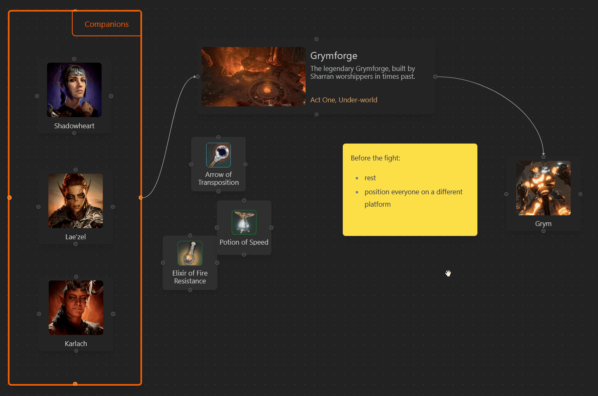

# BG3 Walkthrough Planner

[](https://github.com/Lehoczky/baldurs-gate-3-walkthrough-planner/actions/workflows/ci.yml) [](https://github.com/Lehoczky/baldurs-gate-3-walkthrough-planner/actions/workflows/pages/pages-build-deployment) 

Plan your next walkthrough using an interactive flowchart that was designed exactly for this purpose!

## Features

Drag & drop any weapon, item, location, and more, directly to the chart. You can connect them with edges to put them in sequence, signal dependencies, or whatever comes into your mind!


Write notes for yourself, even in markdown:



## Contributing

Feel free to open a ticket if you have ideas or found a bug.

### Development

The following instructions describes how to start the project locally for development:

Install the dependencies:

```sh
pnpm install
```

Run the frontend application:

```sh
npx nx run frontend:serve
```

Before creating a pull request, make sure every file is formatted and there are no lint errors:

```sh
npx nx format:write

npx nx run-many --target=lint --all=true --fix
```
